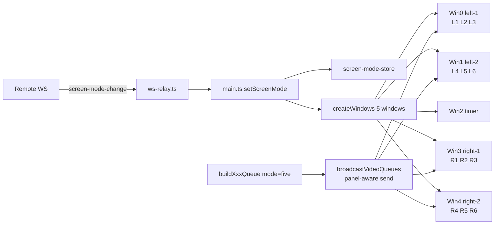

## 0. 작업 단위 (모듈 분리)

소스 600줄 룰과 사용자 룰("모듈단위 분리 확인")을 맞추기 위해 다음 5개 PR/단계로 나눠 작업한다. 각 단계 완료 후 사용자 확인받고 진행.

1. 메인 프로세스: 모드 영속화 + IPC + 창 재생성
2. WS Relay: 리모컨 모드 전환 메시지 라우팅
3. 큐 빌더 공유 모듈 + 4개 서킷 빌더 (stress/loop/emom/amrap) 5-screen 지원
4. 렌더러: 새 라우트(`workout-display-left-2`, `workout-display-right-2`) 및 그리드 셸 매핑
5. 웹앱(리모컨): 3/5 화면 토글 UI + WS 송신

---

## 1. 메인 프로세스 변경

### 1-1. 모드 영속화 모듈 (신규)
- 신규 파일 `packages/electron-app/src/main/screen-mode-store.ts`
  - `getScreenMode(): 'three' | 'five'`, `setScreenMode(mode)` 함수.
  - userData 폴더에 `screen-mode.json` 으로 저장 (electron-store 의존 없이 단순 fs로 처리해도 됨).
  - 기본값 `'three'`.

### 1-2. `packages/electron-app/src/main/main.ts`
- `MonitorWindow.type` 유니온에 `'workout-left-2' | 'workout-right-2'` 추가.
- `screenMode: 'three' | 'five'` 인스턴스 필드 추가, 부팅 시 store 에서 로드.
- `getWindowType(index)` 를 `screenMode` 기반으로 분기:
  - `three`: 기존 그대로 (`0=left, 1=timer, 2=right`)
  - `five`: `0=workout-left, 1=workout-left-2, 2=timer, 3=workout-right, 4=workout-right-2`
- `createWindows()` 에서 `screenMode==='five' && displays.length>=5` 분기 추가. 5개 미만이면 `console.warn` + 폴백으로 3-mode 적용.
- URL 라우팅 switch 에 케이스 추가:
  - `'workout-left-2'` → `#/workout-display-left-2`
  - `'workout-right-2'` → `#/workout-display-right-2`
- 기존 `createWindowForDisplayWithBounds()` 의 switch 에도 동일한 case 추가.

### 1-3. `ipc-handlers.ts` / `main.ts` setupIPC
- 새 IPC 채널:
  - `'get-screen-mode'` → 현재 모드 반환
  - `'set-screen-mode'` (입력: `'three'|'five'`) → 운동 진행 중이면 `{success:false, reason:'workout-active'}`, 아니면 store 저장 → 모든 창 close → `createWindows()` 재호출 → `{success:true}`.
- 운동 진행 여부는 `WorkoutPlayService.activePlaySession?.status === 'playing'` 으로 판단.

---

## 2. WebSocket Relay 라우팅

### 2-1. `packages/electron-app/src/main/ws-relay.ts`
- 서버에서 내려오는 메시지 타입에 `screen-mode-change` (payload: `{mode:'three'|'five'}`) 추가.
- 콜백 `onScreenModeChangeRequest(mode)` 신설 → `main.ts` 에서 set-screen-mode IPC 핸들러와 동일 로직 호출.

---

## 3. 큐 빌더 (메인 프로세스) — 5-screen 지원

### 3-1. 공유 모듈 `circuits/shared/queue-builder-base.ts`
- 새 시그니처:
  - `fillFiveScreenSlotQueues(panel: 'L1'|'L2'|'R1'|'R2', dsGroup1, dsGroup2, mainSets, extraBlocks, cdGroup1, cdGroup2)` 추가.
  - `panel` 별 채움 규칙:
    - `L1` 패널 슬롯1~3: DS1~3 → DS4~6 → L1·L2·L3 → CD1~3 → CD4~6
    - `L2` 패널 슬롯1~3: DS1~3 → DS4~6 → L4·L5·L6 → CD1~3 → CD4~6
    - `R1` 패널 슬롯1~3: DS1~3 → DS4~6 → R1·R2·R3 → CD1~3 → CD4~6
    - `R2` 패널 슬롯1~3: DS1~3 → DS4~6 → R4·R5·R6 → CD1~3 → CD4~6
  - 기존 `fillStandardSlotQueues()` 는 그대로 두고 신규 함수만 추가.
- `QueueBuildResult` 타입을 확장 (`leftQueues2?`, `rightQueues2?` optional 필드).

### 3-2. 각 서킷 빌더
- `stress/stress-queue-builder.ts`, `loop/loop-queue-builder.ts`, `emom/emom-queue-builder.ts`, `amrap/amrap-queue-builder.ts`
- 빌더에 `screenMode` 인자 추가 (기존 호출부와 호환 위해 optional).
- `screenMode === 'five'` 인 경우 `leftQueues2`, `rightQueues2` 도 함께 반환 (`fillFiveScreenSlotQueues('L2'|'R2', ...)`).

### 3-3. `workout-play-service.ts` `broadcastVideoQueues()`
- `screenMode` 를 `screen-mode-store` 에서 읽어 빌더에 전달.
- 5-mode 일 때 `mergedQueues` 를 화면별로 4세트(L1/L2/R1/R2) 분리 송신:
  - 채널을 그대로 두고, `'workout-setup-queue'` payload 에 `panel` 키 추가하여 각 BrowserWindow.webContents.send 로 **창 타입별 분배**(현재는 `broadcastToAllWindows` 사용 → 분배용 신규 헬퍼 추가).
- 3-mode 동작은 기존과 동일 유지.

---

## 4. 렌더러 변경

### 4-1. 라우팅
- `packages/electron-app/src/renderer/renderer.ts` (또는 `electron-renderer-base.ts`) 의 hash route 분기에 `workout-display-left-2`, `workout-display-right-2` 추가 → 기존 left/right 셸 컴포넌트 재사용하되 `side` 식별자에 `'left-2'|'right-2'` 전달.
- `index.html` 에서 그리드 셸이 마운트되는 영역만 보장.

### 4-2. 그리드 셸 / 큐 매니저
- `components/workout-grid-display-shell.ts`, `components/WorkoutGridDisplay.ts`, `components/workout-grid-queue.ts`
- `WorkoutGridQueueManagerDeps.side` 타입을 `'left'|'right'|'left-2'|'right-2'` 로 확장.
- DOM 슬롯 id 규칙:
  - `'left'`/`'right'` : 기존 `video-slot-L1/2/3`, `video-slot-R1/2/3` 유지
  - `'left-2'` : `video-slot-L4/5/6` (또는 `video-slot-L2-1/2/3` 같은 별도 prefix) — 한 가지 규칙으로 통일 후 라벨 prefix 매핑 (`L4→L1` 라벨 표시는 그대로 유지하되 슬롯 DOM 위치는 새 컨테이너).
  - 결정 권장: DOM id 는 `video-slot-{side}-{n}` 패턴으로 통일하고 큐 매니저 내부에서만 prefix 결정 → 로직 단순화.
- `WorkoutPlayService` 가 보내는 `workout-setup-queue` payload 의 `panel` 값에 따라 해당 그리드 셸이 자기 큐만 받도록 필터.

### 4-3. 카운트다운 / 프리뷰
- `getInitialPreviewSequences()` 결과는 5-mode 에서도 동일한 6개 운동 (좌1·좌2·우1·우2 모두 동일 미러링) 으로 표시 → 추가 변경 거의 없음. 단 그리드 셸 4종이 모두 같은 데이터를 받도록 확인.

---

## 5. 웹앱 (리모컨) 토글 UI

### 5-1. UI
- 리모컨 화면(현재 디바이스 제어 페이지) 에 "화면 모드: 3 / 5" 토글 버튼 추가.
- 클릭 시 서버 WS 로 `screen-mode-change` 메시지 송신 (디바이스 ID 포함).
- 운동 진행 중이라 거절(`success:false`) 시 토스트로 안내.

### 5-2. 서버
- (api-server 가 WS hub 라면) 클라이언트→디바이스 메시지 릴레이 라우팅에 새 타입 추가만 하면 됨. 정확한 위치는 5단계 시작 시 추가 조사.

---

## 6. 확인/검증 (각 단계)

- 단계 완료마다 빌드 (`npm run build --workspace=electron-app`) 통과 + 사용자에게 동작 검증 요청.
- 3-mode 회귀 검증: 기본 모드를 `'three'` 로 두고 모든 서킷(Stress/Loop/EMOM/AMRAP) 의 DS·Main·CD 영상 흐름이 변하지 않았는지 확인.
- 5-mode 검증: 5개 디스플레이 환경에서 좌1=L1·L2·L3 → 다음 라운드 그대로 advance, 좌2=L4~ 진행, DS/CD 는 모든 화면 동일 표시.

---

## 7. 데이터 흐름 (5-mode Main)

