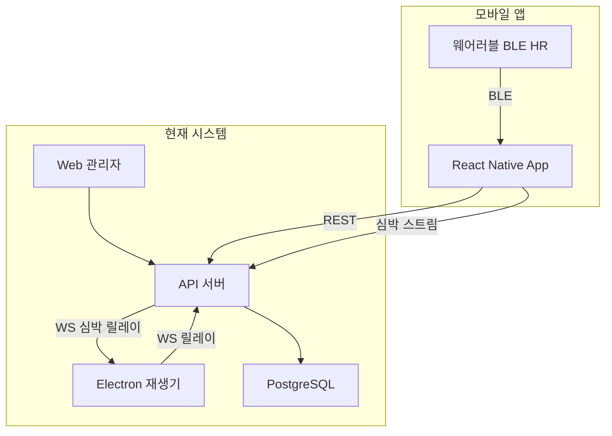
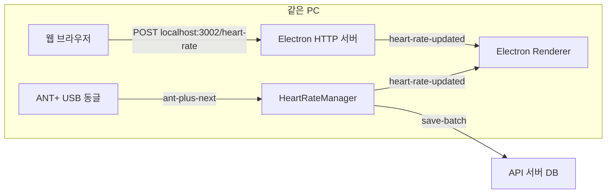
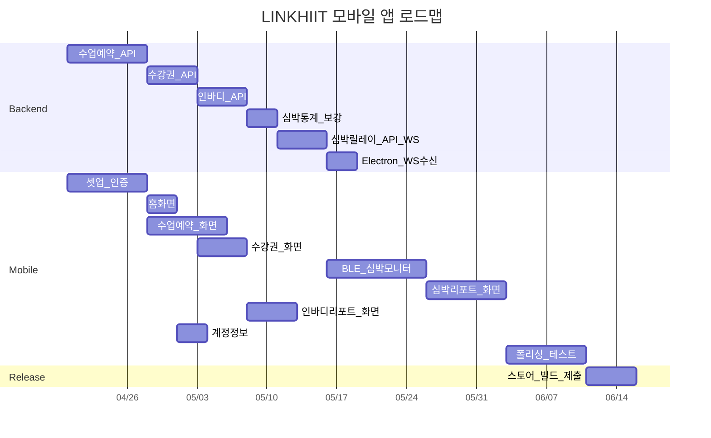

# LINKHIIT 모바일 앱 개발 범위·설계·공수 문서

## 1. 모바일 앱 기능 범위

모바일 앱은 **회원용 서비스 앱**으로, 운동 재생(Electron)·관리자 기능(Web)은 포함하지 않는다.

| 기능 | 설명 |
|------|------|
| **로그인/계정정보** | 로그인·로그아웃·프로필 조회/수정 |
| **수업예약** | 수업 일정 조회, 예약·취소 |
| **수강권** | 보유 수강권 조회, 잔여 횟수/기간, 구매 이력 |
| **심박 리포트** | 운동별 심박 기록 조회, zone 분포, 통계 시각화 |
| **BLE 심박 실시간 전송** | 웨어러블 기기(BLE HR) 연결 → 서버 전송 → Electron 화면에 실시간 표시 |
| **인바디 리포트** | 체성분 측정 기록 조회, 추이 그래프 |

---

## 2. 기존 시스템과의 관계



모바일 앱은 기존 **API 서버에 REST 호출** + **BLE 심박 데이터를 서버로 전송**한다.
서버는 기존 **WebSocket 릴레이**를 확장하여 Electron에 **실시간 심박을 푸시**한다.

---

## 3. 기존 API 재사용 분석

### 3.1 사용 가능 (변경 없음)

| API | 엔드포인트 예시 | 모바일 용도 |
|-----|----------------|------------|
| 인증 | `POST /api/auth/login`, `GET /api/auth/me`, `PATCH /api/auth/profile`, `POST /api/auth/refresh` | 로그인·계정정보 |
| 심박 데이터 | `GET /api/heart-rate/workout/:id`, `GET /api/heart-rate/workout/:id/stats` | 심박 리포트 |
| 심박 임계값 | `GET /api/heart-rate/threshold` | zone 기준 설정 |
| 공지 | `GET /api/announcements` | (선택) 앱 내 알림 |

### 3.2 신규 개발 필요

| 기능 | 현재 상태 | 필요 작업 |
|------|----------|----------|
| **수업예약** | DB·API·UI 모두 없음 | 스키마 설계 + API 라우트 + 모바일 UI |
| **수강권** | DB·API·UI 모두 없음 | 스키마 설계 + API 라우트 + 모바일 UI |
| **인바디 리포트** | DB·API·UI 모두 없음 | 스키마 설계 + API 라우트 + 모바일 UI |
| **심박 리포트 (시각화)** | 데이터 저장·조회 API는 있음, "리포트" 형태 UI 없음 | 모바일 UI + (선택) 통계 API 보강 |

---

## 4. 신규 백엔드 설계 (DB + API)

### 4.1 수업예약

**DB 테이블 (안)**

```sql
-- 수업 정의
CREATE TABLE class_schedules (
  id SERIAL PRIMARY KEY,
  branch_id INTEGER REFERENCES branches(id),
  title VARCHAR(100) NOT NULL,
  instructor_name VARCHAR(50),
  day_of_week SMALLINT,            -- 0=일 ~ 6=토
  start_time TIME NOT NULL,
  end_time TIME NOT NULL,
  max_capacity INTEGER DEFAULT 20,
  is_active BOOLEAN DEFAULT true,
  created_at TIMESTAMPTZ DEFAULT NOW()
);

-- 수업 인스턴스 (특정 날짜)
CREATE TABLE class_instances (
  id SERIAL PRIMARY KEY,
  schedule_id INTEGER REFERENCES class_schedules(id),
  class_date DATE NOT NULL,
  current_count INTEGER DEFAULT 0,
  status VARCHAR(20) DEFAULT 'open',  -- open / full / cancelled
  UNIQUE(schedule_id, class_date)
);

-- 예약
CREATE TABLE class_reservations (
  id SERIAL PRIMARY KEY,
  instance_id INTEGER REFERENCES class_instances(id),
  user_id INTEGER REFERENCES users(id),
  status VARCHAR(20) DEFAULT 'reserved',  -- reserved / cancelled / attended
  reserved_at TIMESTAMPTZ DEFAULT NOW(),
  cancelled_at TIMESTAMPTZ,
  UNIQUE(instance_id, user_id)
);
```

**API 라우트 (안)**: `/api/classes`

| 메서드 | 경로 | 용도 | 권한 |
|--------|------|------|------|
| GET | `/schedules?branch_id=&week=` | 주간 수업 일정 조회 | 회원 |
| GET | `/instances/:id` | 수업 상세 (잔여석 포함) | 회원 |
| POST | `/reservations` | 예약 생성 | 회원 |
| DELETE | `/reservations/:id` | 예약 취소 | 회원 |
| GET | `/reservations/my` | 내 예약 목록 | 회원 |
| POST | `/schedules` | 수업 생성 | 관리자 |
| PUT | `/schedules/:id` | 수업 수정 | 관리자 |
| POST | `/instances/:id/cancel` | 수업 취소 | 관리자 |

### 4.2 수강권

**DB 테이블 (안)**

```sql
-- 수강권 상품
CREATE TABLE membership_plans (
  id SERIAL PRIMARY KEY,
  branch_id INTEGER REFERENCES branches(id),
  name VARCHAR(100) NOT NULL,
  type VARCHAR(20) NOT NULL,         -- period / count / unlimited
  duration_days INTEGER,             -- 기간제: 일 수
  total_count INTEGER,               -- 횟수제: 총 횟수
  price DECIMAL(10,2),
  is_active BOOLEAN DEFAULT true,
  created_at TIMESTAMPTZ DEFAULT NOW()
);

-- 회원 보유 수강권
CREATE TABLE user_memberships (
  id SERIAL PRIMARY KEY,
  user_id INTEGER REFERENCES users(id),
  plan_id INTEGER REFERENCES membership_plans(id),
  start_date DATE NOT NULL,
  end_date DATE,
  remaining_count INTEGER,
  status VARCHAR(20) DEFAULT 'active',  -- active / expired / paused / cancelled
  purchased_at TIMESTAMPTZ DEFAULT NOW()
);

-- 수강권 사용 이력
CREATE TABLE membership_usage_logs (
  id SERIAL PRIMARY KEY,
  membership_id INTEGER REFERENCES user_memberships(id),
  used_at TIMESTAMPTZ DEFAULT NOW(),
  usage_type VARCHAR(20) DEFAULT 'class',  -- class / manual_deduct
  reference_id INTEGER                      -- class_reservations.id 등
);
```

**API 라우트 (안)**: `/api/memberships`

| 메서드 | 경로 | 용도 | 권한 |
|--------|------|------|------|
| GET | `/my` | 내 수강권 목록 (활성/만료) | 회원 |
| GET | `/my/:id` | 수강권 상세 + 사용 이력 | 회원 |
| GET | `/plans?branch_id=` | 상품 목록 | 회원 |
| POST | `/` | 수강권 발급 (관리자가 등록) | 관리자 |
| PATCH | `/:id/pause` | 일시정지 | 관리자 |
| PATCH | `/:id/resume` | 재개 | 관리자 |

### 4.3 인바디 리포트

**DB 테이블 (안)**

```sql
CREATE TABLE inbody_records (
  id SERIAL PRIMARY KEY,
  user_id INTEGER REFERENCES users(id),
  measured_at TIMESTAMPTZ NOT NULL,
  weight DECIMAL(5,1),
  skeletal_muscle_mass DECIMAL(5,1),    -- 골격근량
  body_fat_mass DECIMAL(5,1),           -- 체지방량
  body_fat_percentage DECIMAL(4,1),     -- 체지방률
  bmi DECIMAL(4,1),
  basal_metabolic_rate INTEGER,         -- 기초대사량
  total_body_water DECIMAL(5,1),        -- 체수분
  raw_data JSONB,                       -- 기타 항목 확장용
  created_at TIMESTAMPTZ DEFAULT NOW()
);
```

**API 라우트 (안)**: `/api/inbody`

| 메서드 | 경로 | 용도 | 권한 |
|--------|------|------|------|
| GET | `/my` | 내 인바디 기록 목록 (최신순) | 회원 |
| GET | `/my/:id` | 기록 상세 | 회원 |
| GET | `/my/trend` | 추이 데이터 (기간별 주요 지표) | 회원 |
| POST | `/` | 기록 입력 | 관리자 |
| PUT | `/:id` | 기록 수정 | 관리자 |
| DELETE | `/:id` | 기록 삭제 | 관리자 |

---

## 5. BLE 심박 실시간 전송 → Electron 표시 설계

### 5.1 현재 심박 데이터 흐름 (AS-IS)



- ANT+ 경로: USB 동글 → `HeartRateANTManager` → `HeartRateManager.collectFromANT` → `broadcastToAllWindows('heart-rate-updated', ...)` → 렌더러 표시
- 웹 경로: 같은 PC의 브라우저가 `POST http://localhost:3002/heart-rate`로 직접 전송 → Electron HTTP 서버 → `broadcastToAllWindows('heart-rate-updated', ...)` → 렌더러 표시
- **두 경로 모두 같은 로컬 네트워크/PC 내에서만 동작**

### 5.2 추가할 흐름 (TO-BE)


모바일 앱이 외부 네트워크에 있으므로 **API 서버를 실시간 중계 허브**로 사용한다. 기존 WebSocket 릴레이(`ws-relay.ts` ↔ `electronRelay.service.ts`)에 **심박 메시지 타입을 추가**하는 것이 가장 자연스럽다.

### 5.3 구현 상세

#### (A) 모바일 앱 — BLE 수집·전송

```
모바일 앱 구조:
src/
├── heart-rate/
│   ├── ble-scanner.ts          # react-native-ble-plx: 스캔·연결·구독
│   ├── hr-data-sender.ts       # 수집된 HR을 서버로 전송 (배치 또는 실시간)
│   └── ble-permissions.ts      # iOS/Android 권한 처리
```

- **BLE Heart Rate Service** (UUID `0x180D`), **Heart Rate Measurement** (UUID `0x2A37`) 구독
- 수신 주기: ~1초 (기기 의존)
- **전송 전략**: 1~2초 간격으로 `POST /api/heart-rate/live`에 JSON 전송

```typescript
// 전송 페이로드
interface MobileHeartRatePayload {
  userId: number
  deviceId: string       // BLE peripheral UUID
  deviceName: string     // e.g. "Polar H10"
  heartRate: number
  timestamp: string      // ISO 8601
  branchId?: number
}
```

#### (B) API 서버 — 수신 + 릴레이

**신규 엔드포인트**: `POST /api/heart-rate/live`

```typescript
// heartrate.routes.ts에 추가
router.post('/live', authenticateToken, async (req, res) => {
  const { userId, deviceId, deviceName, heartRate, timestamp, branchId } = req.body
  // 1) 해당 branchId에 연결된 Electron 디바이스 조회
  // 2) WebSocket으로 heart-rate-live 메시지 전송
  // 3) (선택) DB에도 저장 (기존 save-batch 로직 재사용)
})
```

**WebSocket 릴레이 확장** (`electronRelay.service.ts`):

```typescript
// 기존 sendCommand 외에 심박 전용 브로드캐스트 추가
sendHeartRateToDevice(deviceId: string, data: {
  type: 'heart-rate-live'
  userId: number
  deviceId: string
  deviceName: string
  heartRate: number
  timestamp: string
})
```

같은 branch에 연결된 **모든 Electron 디바이스**에 브로드캐스트하거나, 특정 디바이스를 지정할 수 있다.

#### (C) Electron — WS 수신 + 렌더러 표시

**`ws-relay.ts` 확장**: `executeCommand`에 `heart-rate-live` 메시지 타입 추가

```typescript
// ws-relay.ts의 메시지 처리 분기에 추가
if (message.type === 'heart-rate-live') {
  // broadcastToAllWindows('heart-rate-updated', ...) 호출
  // 기존 ANT+ 경로와 동일한 채널을 사용하므로 렌더러 UI 변경 불필요
  broadcastToAllWindows('heart-rate-updated', {
    slotNumber: message.slotNumber || 0,
    deviceName: message.deviceName,
    heartRate: message.heartRate,
    deviceId: message.deviceId,
  })
  return
}
```

**핵심**: 기존 `heart-rate-updated` 채널을 그대로 사용하면, 렌더러의 **타이머 UI·심박 패널 등 기존 표시 코드는 수정 없이 동작**한다.

### 5.4 ANT+ vs 모바일 BLE 공존

체육관에서 ANT+ 동글과 모바일 BLE 심박이 **동시에 들어올 수 있다**.

| 출처 | deviceId 형식 | 구분 방법 |
|------|--------------|----------|
| ANT+ (기존) | `ant-{deviceId}` | prefix로 구분 |
| 모바일 BLE (신규) | `ble-{peripheralUUID}` | prefix로 구분 |

슬롯 매핑은 기존 ANT의 슬롯 1~20 체계를 확장하거나, 모바일 BLE는 별도 슬롯 범위(21~)를 사용할 수 있다.

### 5.5 모바일 BLE 기술 고려사항

| 항목 | iOS | Android |
|------|-----|---------|
| 권한 | `NSBluetoothAlwaysUsageDescription`, 위치 권한 불필요 (iOS 13+) | `BLUETOOTH_SCAN`, `BLUETOOTH_CONNECT` (Android 12+), 위치 권한 (Android 11-) |
| 백그라운드 | Core Bluetooth BGMode 가능, 단 OS가 throttle | ForegroundService + 알림 필요 |
| 재연결 | `centralManager.connect` 자동 재연결 지원 | GATT 연결 해제 시 수동 재연결 로직 필요 |
| 배터리 | HR 1초 알림 시 영향 적음 | 동일 |

---

## 6. 모바일 앱 화면 구성 (9개)

| 화면 | 주요 요소 | API |
|------|----------|-----|
| **로그인** | 아이디/비밀번호 입력, JWT 저장 | `POST /api/auth/login` |
| **홈** | 오늘 예약 수업, 수강권 잔여, 최근 심박 요약 | 복합 호출 |
| **수업 일정** | 주간/일간 캘린더, 수업 카드, 예약 버튼 | `/api/classes/*` |
| **예약 내역** | 예약 목록, 취소 버튼 | `/api/classes/reservations/my` |
| **수강권** | 보유 수강권 카드 (잔여 횟수/기간 게이지), 상품 목록 | `/api/memberships/*` |
| **심박 모니터** | BLE 기기 스캔·연결, 실시간 HR 표시, 서버 전송 상태 | BLE + `POST /api/heart-rate/live` |
| **심박 리포트** | 운동별 HR 차트, zone 분포 도넛, 통계 카드 | `/api/heart-rate/*` |
| **인바디 리포트** | 측정 기록 목록, 추이 선 그래프 (체중·골격근·체지방) | `/api/inbody/*` |
| **계정정보** | 프로필 조회/수정, 비밀번호 변경, 로그아웃 | `/api/auth/me`, `PATCH /api/auth/profile` |

---

## 6. 기술 스택

| 항목 | 선택 | 이유 |
|------|------|------|
| 프레임워크 | React Native (Expo) | 기존 React·TypeScript 역량 활용 |
| 네비게이션 | React Navigation (Tab + Stack) | RN 표준 |
| 상태 관리 | Zustand 또는 Redux Toolkit | 경량 / 기존 패턴 호환 |
| HTTP | Axios | 기존 `api.ts` 패턴 재사용 |
| BLE | react-native-ble-plx | BLE Heart Rate Service 구독 |
| 차트 | react-native-chart-kit 또는 Victory Native | 심박·인바디 시각화 |
| 보안 저장 | expo-secure-store | JWT 토큰 |
| 백그라운드 | react-native-background-timer | BLE 수집 중 화면 꺼짐 방지 |
| 푸시 알림 (선택) | expo-notifications | 수업 리마인더 |

---

## 8. 공수 산정 (1명 풀타임)

### 8.1 백엔드 (API 서버 + Electron 확장)

| 작업 | 기간 |
|------|------|
| 수업예약 DB 스키마 + API + 테스트 | 1.5주 |
| 수강권 DB 스키마 + API + 테스트 | 1주 |
| 인바디 DB 스키마 + API + 테스트 | 1주 |
| 심박 리포트 통계 API 보강 (선택) | 0.5주 |
| **심박 실시간 릴레이**: `POST /api/heart-rate/live` + WS 릴레이 확장 | 1주 |
| **Electron 수신**: `ws-relay.ts`에 `heart-rate-live` 처리 + 기존 UI 연동 확인 | 0.5주 |
| **백엔드 소계** | **5.5주** |

### 8.2 모바일 앱

| 작업 | 기간 |
|------|------|
| 프로젝트 셋업 + 네비게이션 + 인증 흐름 | 1.5주 |
| 홈 화면 | 0.5주 |
| 수업 일정·예약 화면 | 1.5주 |
| 수강권 화면 | 1주 |
| **BLE 심박 모니터**: 스캔·연결·실시간 표시 + 서버 전송 | 2주 |
| 심박 리포트 화면 (차트 포함) | 1.5주 |
| 인바디 리포트 화면 (차트 포함) | 1주 |
| 계정정보 화면 | 0.5주 |
| UI 폴리싱 + 다크모드 | 1주 |
| 통합 테스트 (BLE 실기기 포함) + 버그 수정 | 1.5주 |
| 스토어 빌드 파이프라인 (iOS + Android) | 1주 |
| **앱 소계** | **13주** |

### 8.3 총 합계

| 구분 | 기간 |
|------|------|
| 백엔드 + 앱 **순차** 진행 (1명) | **약 18.5주 (~4.5개월)** |
| 백엔드·앱 **병렬** 진행 (2명) | **약 13주 (~3개월)** |

### 8.4 공수 비교

| 범위 | 공수 (1명) |
|------|------------|
| ~~운동 재생 엔진 포함~~ (최초 추정) | ~~4~9개월~~ |
| 조회·예약·리포트 중심 (이전 버전) | ~3.5개월 |
| **+ BLE 심박 실시간 전송·릴레이** (현재) | **~4.5개월** |

BLE 수집·서버 릴레이·Electron 연동 추가로 **약 1개월** 증가했다. 단, 기존 WebSocket 릴레이와 Electron 심박 UI를 재사용하므로 완전 신규 대비 효율적이다.

---

## 9. 리스크 요소

| 리스크 | 영향 | 완화 |
|--------|------|------|
| 수업예약 동시성 (정원 초과) | 이중 예약 | DB UNIQUE 제약 + 트랜잭션 |
| 인바디 데이터 입력 방식 | 수동 입력 번거로움 | 관리자 웹에서 일괄 입력 or CSV import |
| 스토어 심사 지연 (Apple) | 일정 지연 | TestFlight 조기 시작 |
| 심박 데이터가 없는 회원 | 빈 리포트 UI | 안내 메시지 + 샘플 데이터 |
| BLE 백그라운드 정책 (iOS) | 운동 중 HR 끊김 | ForegroundService + KeepAwake + 재연결 로직 |
| BLE 기기 호환성 | 특정 기기에서 동작 안 함 | 표준 HR Service 준수 기기만 지원, 테스트 목록 관리 |
| WS 릴레이 지연 | 심박 표시 1~2초 딜레이 | 허용 가능 수준, 필요 시 전송 주기 조정 |
| 수강권 결제 연동 | 범위 확대 | 1단계는 관리자 수동 등록, 결제는 2단계 |

---

## 10. 단계별 로드맵



위 간트에서 백엔드·앱 셋업은 **병렬 진행**을 가정하며, 심박 릴레이 API가 준비된 뒤 모바일 BLE 화면을 붙이는 구조이다.
